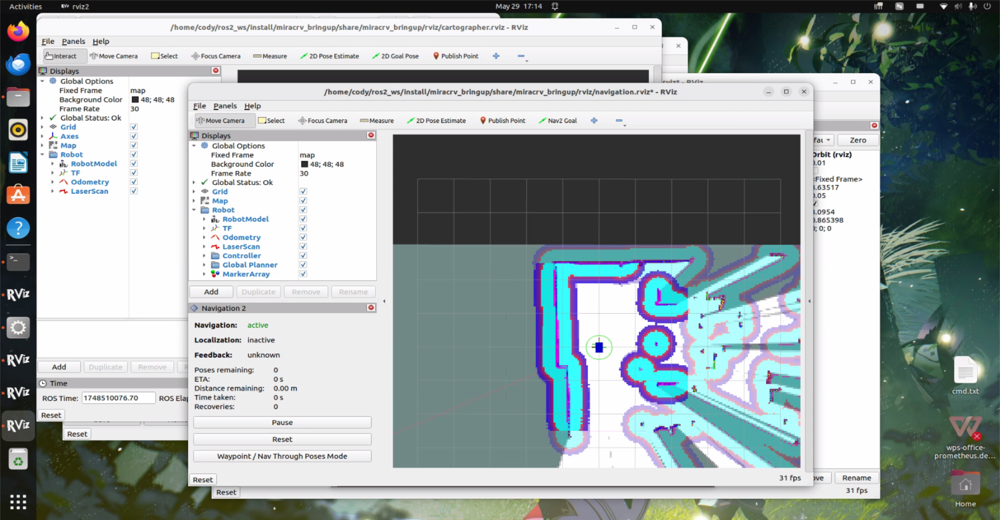

# MiracRV

琪迹小车，基于RISC-V开发板的ROS小车

组装和说明文档请查看：[MiracRV_docs](https://github.com/discodyer/miracrv_docs) [Gitlab](https://isrc.iscas.ac.cn/gitlab/ros2-rv/miracrv_docs)

## 仓库包含的软件包

- `miracrv_msgs` 提供所有消息格式

- `miracrv_driver` 提供小车底盘控制接口

- `miracrv_bringup` 提供launch脚本，一键启动小车节点

- `miracrv_description` 提供小车模型等

## ArduRover参数设置

我们使用ArduPilot的EKF3进行位姿估计，EKF3依赖外部传感器，比如GPS、光流、车轮编码器、视觉里程计、激光雷达等的数据，否则无法在Guided模式下解锁。

下面的配置是在室内情况下，无GPS，使用激光雷达进行位姿估计。如果是室外使用，可以加装GPS模块并按照ArduPilot相关文档配置。

- `FRAME_TYPE` = 2 设置机架类型为 OmniX
- `SERVO1_FUNCTION` = 33 设置为 Motor1
- `SERVO2_FUNCTION` = 34 设置为 Motor2
- `SERVO3_FUNCTION` = 35 设置为 Motor3
- `SERVO4_FUNCTION` = 36 设置为 Motor4

- `GPS_TYPE` = 0 禁用 GPS
- `ARMING_CHECK` = 388598 禁用 GPS 相关解锁检查
- `AHRS_GPS_USE` = 0 禁用 GPS
- `EK3_GPS_CHECK` = 0 禁用 GPS 检查
- `EK3_GSF_RUN_MASK` = 0 禁用 EKF-GSF
- `EK3_GSF_USE_MASK` = 0 禁用 EKF-GSF
- `AHRS_OPTIONS` = 3 禁止 EKF3 自动回退到 DCM

- `EK3_SRC_OPTIONS` = 0 速度融合选项，因为没有其他速度源所以为 0
- `AHRS_EKF_TYPE` = 3 启用 EKF3
- `EK2_ENABLE` = 0 禁用 EKF2
- `EK3_ENABLE` = 1 启用 EKF3
- `EK3_SRC1_POSXY` = 6 将位置水平源设置为 ExternalNAV
- `EK3_SRC1_POSZ` = 1 将位置垂直源设置为气压计
- `EK3_SRC1_VELXY` = 6 将速度水平源设置为 ExternalNAV
- `EK3_SRC1_VELZ` = 6 将垂直速度源设置为 ExternalNAV
- `EK3_SRC1_YAW` = 6 将偏航源设置为 ExternalNAV
- `VISO_TYPE` = 1 启用视觉里程计类型为 MavLink

其他参数如遥控器接收机，电调类型等需要根据购买的型号不同来修改相关参数，并且在修改完上述参数后还需要常规的进行校准加速度计、校准水平、校准遥控器、校准磁罗盘等操作，可以使用MissionPlanner地面站完成。

## 安装和构建软件包

首先，创建一个工作区，比如

```bash
mkdir -p ros2_ws/src
cd ros2_ws/src
```

随后克隆本仓库和镭神雷达仓库

```bash
git clone -b M10P/N10P https://github.com/Lslidar/Lslidar_ROS2_driver.git
git clone https://github.com/discodyer/miracrv.git
```

构建镭神雷达的时候可能需要额外安装这个包

```bash
sudo apt-get install libpcap0.8-dev
```

然后构建工作区

```bash
cd ..
colcon build
source ./install/setup.bash
```

运行整个代码只需要执行两个launch文件

```bash
# 启动 mavros、lslidar、miracrv_driver、tf_to_odom、cartographer
ros2 launch miracrv_bringup miracrv.launch.py
# 启动 navigation2
ros2 launch miracrv_bringup navigation.launch.py
```

